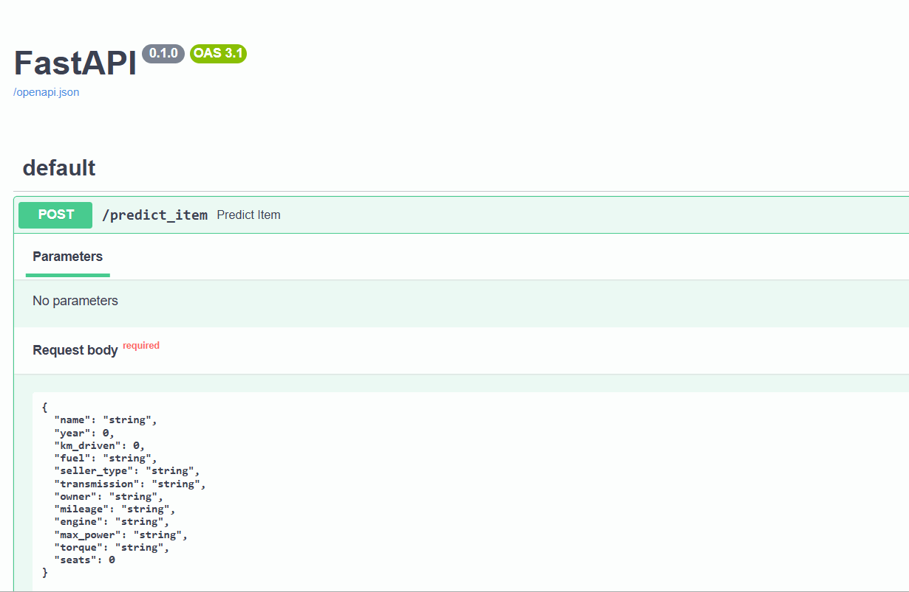

# Домашнее задание ML №1 Pro

## Описание работы
Работа посвящена предсказанию цен автомобилей по их характеристикам. Вся исследовательская часть приведена в ноутбуке **AI_HW1_Martynov_Alexander_Pro.ipynb**. 
Также развернут бэкенд сервис с двумя запросами: нахождение предсказаний по одному или нескольким объектам сразу. 
## Демо бэкенда

## Структура репозитория
├── /back # файлы с бэкендом  
│ ├── main.py # Главный файл бэкенд сервиса 
│ ├── utils.py # модуль с функциями  
├── /models # Сохраненные модели для инференса  
│ ├── medians.json # Файл с медианами для заполнения пропусков в тестовых данных 
│ ├── ohe_trained.pkl # Модель OHE для преобразования кат. фичей 
│ ├── ridge_regr_trained.pkl # Модель ridge регрессии для инференса  
├──AI_HW1_Martynov_Alexander_Pro.ipynb # Ноутбук с исследовательской частью 
├──your_report.html # дашборд таблиц из начала домашнего задания
## Заключение
В ходе работы удалось опробовать модели линейной регрессии с различными регуляризаторами, реализовать свою регуляризацию L0, 
протестировать данные на различных моделях. Наилучший буст выдала ridge регресия с ohe признаками на входе обучения.
Здесь я забыл стандартизировать признаки (вспомнил про это на этапе создания бэкенда, когда все уже было обучено).
Дополнительно делать это не стал, тк в экспериментах на других моделях стандартизация вообще ни насколько не улучшала метрики.
